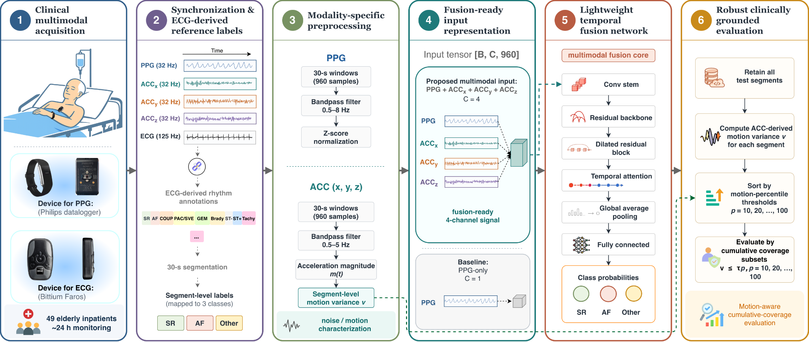

# Multimodal PPG–Accelerometer Fusion for Three-Class Heart Rhythm Classification in Elderly Inpatients

This repository provides the main implementation for the manuscript **“Multimodal PPG–Accelerometer Fusion for Three-Class Heart Rhythm Classification in Elderly Inpatients.”**

The study investigates three-class heart rhythm classification using wrist photoplethysmography (PPG) and tri-axial accelerometer (ACC) signals collected from elderly inpatients. The classification task includes sinus rhythm (SR), atrial fibrillation (AF), and other rhythms. The repository includes data loading, preprocessing, model construction, training, and evaluation scripts for the proposed multimodal fusion model and reproduced baseline models.



Figure 1. Overview of the proposed lightweight PPG–ACC fusion pipeline. Wrist PPG and tri-axial ACC signals were collected from elderly inpatients using a Philips datalogger, while chest ECG from a Bittium Faros device served as the reference standard. ECG-derived annotations were aligned with the wearable recordings and mapped into 30 s segment-level SR, AF, and Other labels. After preprocessing, PPG and ACC signals were combined into a four-channel input and processed by a lightweight temporal network with residual, dilated convolutional, and temporal attention components. During evaluation, all test segments were retained, and ACC-derived motion variance was used for motion-percentile cumulative-coverage analysis.

## Project Overview

The experiments are organized around three main comparisons:

- Input configuration comparison: the proposed model is evaluated using PPG-only, reproduced 4-channel input, and PPG+ACC fusion settings.
- Backbone comparison under a unified PPG+ACC input: the proposed model is compared with reproduced literature baselines and classical 1D CNN backbones under matched settings.
- Reproduced literature comparison with paper-matched input settings: selected reproduced models are evaluated using their corresponding input settings when applicable.

The evaluation follows a motion-aware cumulative-coverage protocol. Test segments are not excluded by signal-quality rules. Instead, ACC-derived motion variance is used to analyze model performance across cumulative motion-percentile thresholds.

## Repository Structure

```text
.
├── README.md
├── config.py
├── dataset.py
├── Processing.py
├── model.py
├── train.py
├── evaluation.py
├── main.py
├── run_batch_30s.py
├── model_overview.png
└── Networks/
    ├── ResNet10_TemporalAttention_DilatedL2.py
    ├── ResNet10_TemporalAttention_SE.py
    ├── BiGRU2025.py
    ├── CNN17.py
    ├── KDD2019.py
    ├── MobileNet.py
    ├── VGG16.py
    └── resnet.py

## Code Availability

This repository contains the main implementation used in the study.
